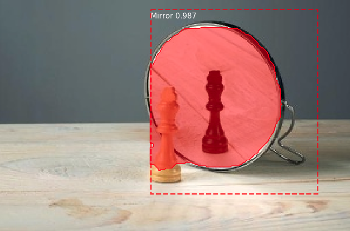

# Mirror Project

## Task 1 : Mirror Detector


## Change Log
2018/5/6    add move.py, transform label.png to label8.png, mirror.py is ok, train network is ok.

2018/5/5    Create project

## Environment
python3.5    tensorflow1.8.0    keras2.1.6

CPU : Intel(R) Core(TM) i7-7700K CPU @ 4.20GHz

GPU : NVIDIA GTX 1080Ti

Docker Image : tf1.8.0-keras2.1.6-gpu:9.0-cudnn7-devel-ubuntu16.04

'sudo pip3 install -r requirements.txt'

#### labelme tool
*python2*

sudo apt-get install python-pyqt5  

sudo pip install labelme

Modify app.py:

```
import sys
reload(sys)
sys.setdefaultencoding('utf-8')
```

## Usage
`python train_mirror.py`

## TODO
- [x] Collecting images containing mirrors
- [x] Data preprocessing : Rename --> Resize --> label mirror --> move.py --> json_to_dataset --> transform(16 to 8)(label8.png and info.yaml)
- [x] mirror.py (what the occlusion?)
- [x] train_mirror.py (Training head and all.)
- [x] Using tensorboard to keep watch on training
- [ ] test_mirror.py (Including save test results.)
- [ ] Next task ...

## License
* For academic and non-commercial use only.
* For commercial use, please contact [mhy845879017@gmail.com](https://www.google.com/gmail/).