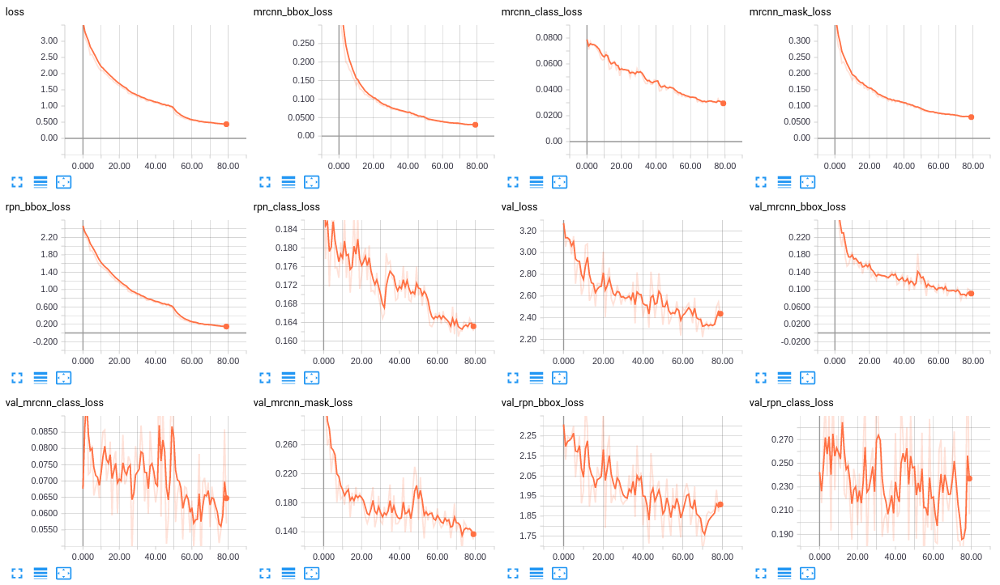

# Mirror Project


## Change Log
2018/7/27   Tried to changed mask branch, bad results. Begin to augment data set.

2018/7/25   mAP and mAP_range is ok, but i am not sure whether it is right or not. 

Heads : mean_mAP 0.8920863309352518 mean_mAP_range 0.7190647482014391

All: mean_mAP 0.9406474820143885 mean_mAP_range 0.7733812949640293

2018/7/22   Trained with 2111 train-images, 93 validation-images, and 139 test-images. 50 epoches for heads and another 30 epoches for all cost approximately 10 hours, and Mask R-CNN based model achieves relative satisfactory results.  

2018/7/18   Trained model with new dataset on my own computer. However, some images have incorrect mask. Furthermore, inference time is too slow due to unknown reason.

2018/6/4    train:593  val:51  test:50

2018/5/9    test model on server, begin to make presentation.

2018/5/8    training on the server. **But there still have an error when validaition batch size is two. one is ok.**
            Saving new image _tf1.7.0-keras2.1.6-gpu:9.0-cudnn7.0.5-devel-ubuntu16.04_

2018/5/7    test_mirror.py is ok, add author information template.

2018/5/6    add move.py, transform label.png to label8.png, mirror.py is ok, train network is ok.

2018/5/5    Create project.

## Environment
python3.5    

**My Computer:**

CPU : Intel(R) Core(TM) i7-8700 @ 3.20GHz x 12

GPU : NVIDIA GTX 1080Ti

ubuntu16.04

CUDA : 9.0.176

cudnn : 7.1.4

tensorflow1.7.0    keras2.1.6   numpy1.14.3

**Server:**

tensorflow1.7.0    keras2.1.6   numpy1.14.3

CPU : Intel(R) Core(TM) i7-7700K @ 4.20GHz

GPU : NVIDIA GTX 1080Ti

Docker Image : tf1.7.0-keras2.1.6-gpu:9.0-cudnn7.0.5-devel-ubuntu16.04_

'sudo pip3 install -r requirements.txt'

#### labelme tool
*python2*

sudo apt-get install python-pyqt5  

sudo pip install labelme

Modify app.py:

```
import sys
reload(sys)
sys.setdefaultencoding('utf-8')
```

## Usage
`python train_mirror.py`

## TODO
- [x] Collecting images containing mirrors
- [x] Data preprocessing : Rename --> Resize --> label mirror --> move.py --> json_to_dataset --> transform(16 to 8)(label8.png and info.yaml)
- [x] mirror.py (what the occlusion? Understand on July 25th.)
- [x] train_mirror.py (Training head and all.)
- [x] Using tensorboard to keep watch on training
- [x] test_mirror.py (Including save test results.)
      
     **After a long pause, restart the project at June 29th.**
- [x] Adding evaluation code.(AP, mAP, box-recall, etc.) (AP-bbox is still unresolved.)
- [ ] Data augmentation.(flipping(left-right and top-down), rotation(90, 180 and 270), and cropping.)
- [ ] Determine Baseline (Refined network based on our dataset) and Begin to improve the architecture of network.(Such as PANet.)

## Loss


## License
* For academic and non-commercial use only.
* For commercial use, please contact [mhy845879017@gmail.com](https://www.google.com/gmail/).